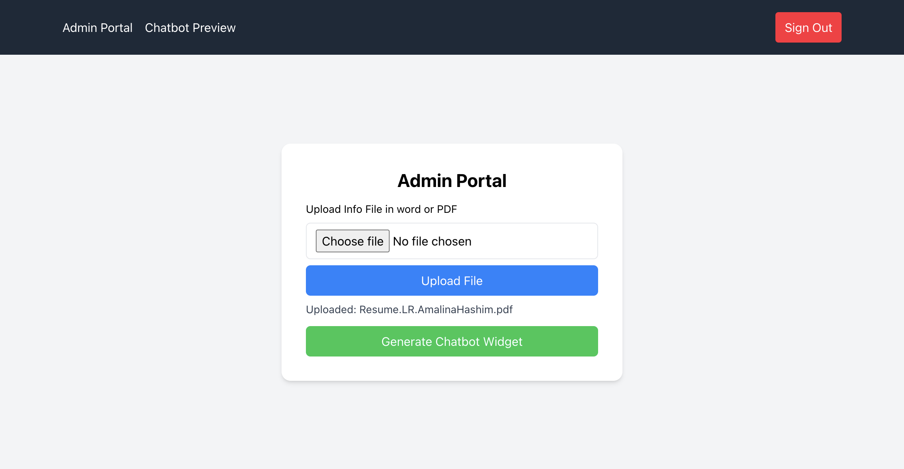
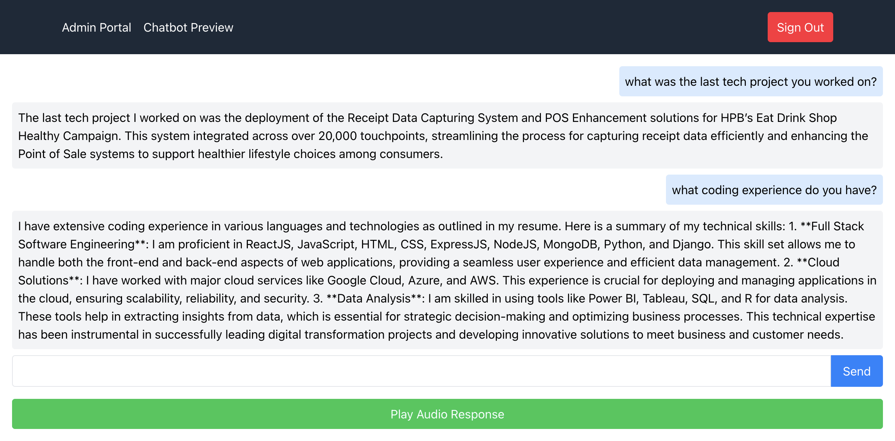

# Chatbot Widget Project

This project consists of an admin portal and a chatbot widget. The admin portal allows users to upload their information and generate a chatbot widget, which can be integrated into any existing ReactJS project. The chatbot widget can be used to interact with users and respond to their queries based on the uploaded information. Access backend code here()

## Features

- User authentication (signup and login)
- File upload (PDF, DOCX)
- Chatbot widget generation
- Chatbot interaction with text and audio responses

## Technologies used

- ReactJS
- Tailwind CSS

### Admin Portal



## How to Integrate Chatbot Widget

1. Download the `chatbot-widget.zip` file generated from the admin portal.
2. Extract the contents of the `chatbot-widget.zip` file. It should contain `ChatBotWidget.js`, `ChatBot.js`, `widget-code.html`, and `README.md`.
3. Copy `ChatBotWidget.js` and `ChatBot.js` to a suitable location in your React project (e.g., `src/components`).
4. Add the following HTML to your `public/index.html` or any HTML file that is rendered as part of your React application:

    ```html
    <div id="chatbot-button" style="position:fixed; bottom:20px; right:20px; cursor:pointer; background-color:#5a00ff; color:white; padding:10px; border-radius:50%; z-index:1000;">
      Chat
    </div>
    <div id="chatbot-container" style="position:fixed; bottom:70px; right:20px; z-index:1000;"></div>
    <script src="%PUBLIC_URL%/components/ChatBotWidget.js"></script>
    <script>
      document.getElementById("chatbot-button").onclick = function() {
        if (!document.getElementById("chatbot-widget")) {
          renderChatBotWidget('chatbot-container');
        }
      }
    </script>
    ```

5. Make sure to replace `%PUBLIC_URL%` with the correct path to where you placed the `ChatBotWidget.js` file.


## Getting Started

1. Clone the repository:

    ```bash
    git clone https://github.com/Amalina-Hashim/chatbot_FE.git
    ```

2. Install dependencies:

    ```bash
    npm install
    ```

3. Start the backend server:

    ```bash
    npm start
    ```

4. Start the frontend development server:

    ```bash
    npm run start:frontend
    ```

5. Access the admin portal at `http://localhost:3000`.


